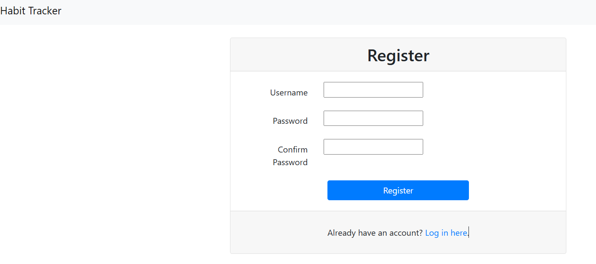
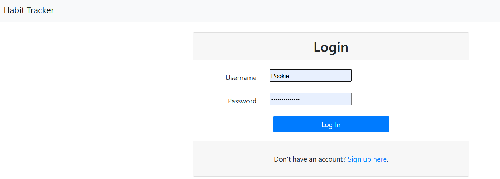
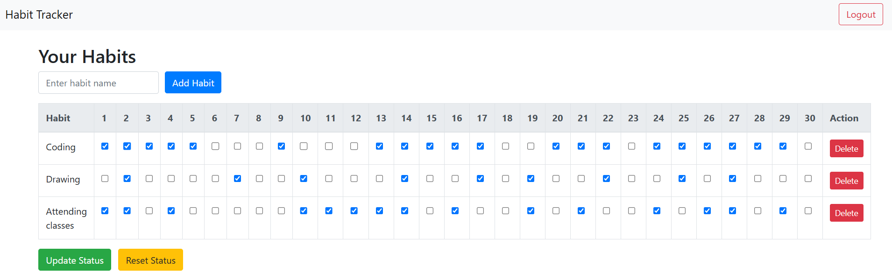

# Habit Tracker (Django Project)

A simple Habit Tracker web application built using Django. Users can register, log in, and track their habits.

## Features

- User registration and login  
- Add and view daily habits  
- Simple and clean UI with Bootstrap  
- Logout functionality with CSRF protection  

## Project View
### Register Page


### Log in page


### Home page

## How to run

### 1. Clone the repository

```bash
git clone https://github.com/Somaiya-0/Habit_Tracker_django_project.git
cd Habit_Tracker_django_project
```

### 2. Create a virtual environment (optional but recommended)

```bash
python -m venv venv
source venv/bin/activate        # On Linux/macOS
venv\Scripts\activate           # On Windows
```

### 3. Install Django

```bash
pip install django
```
### 4.  Run migrations
```bash
python manage.py makemigrations
python manage.py migrate
```

### 5. Run the development server
```bash
python manage.py runserver
```

### 6. Access the app

Open your browser and go to:
http://127.0.0.1:8000/


## Notes

- CSRF protection is enabled for logout using a POST request.  
- The logout button redirects to the login page.  
- The navbar updates based on the login status and current page.  

## Author

**[Somaiya-0](https://github.com/Somaiya-0)**

## License

This project is open-source and free to use.


